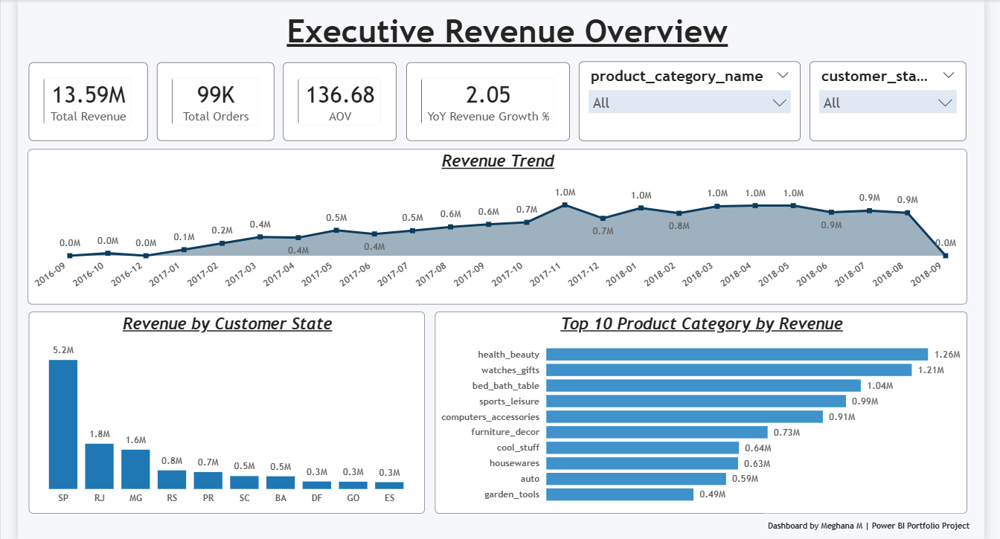
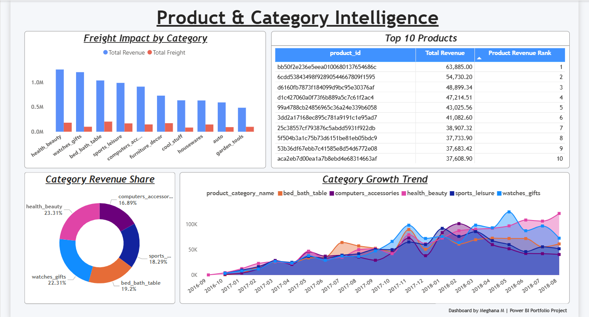
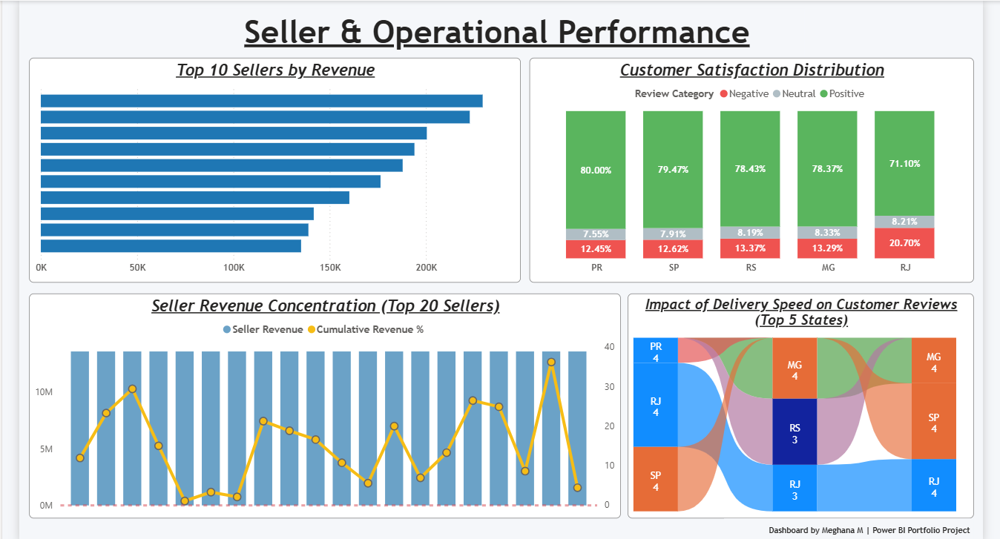
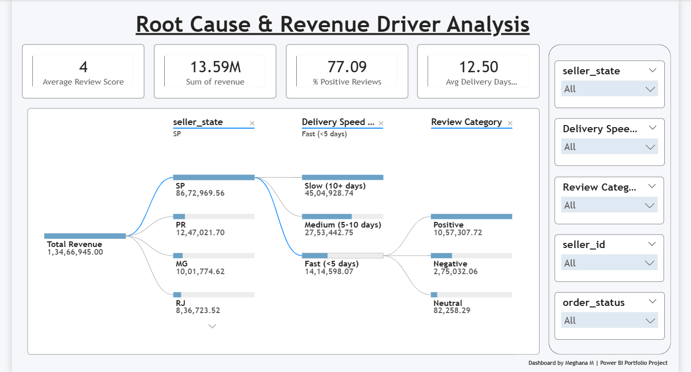
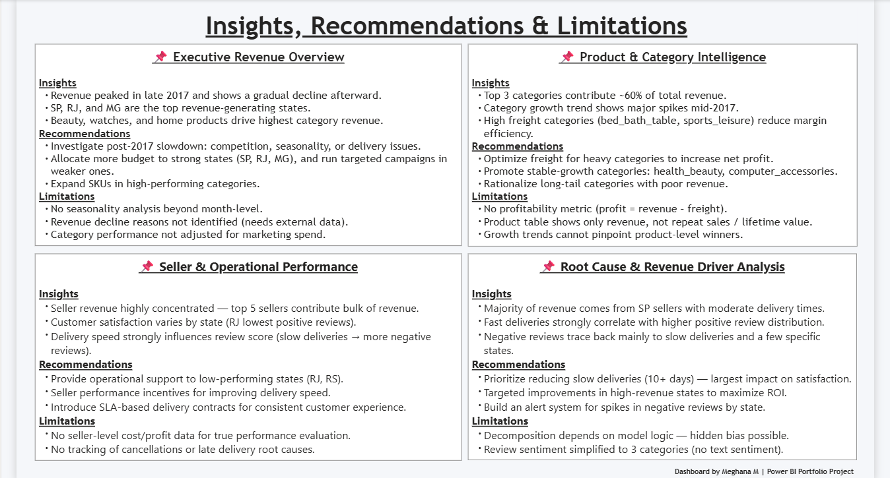

# 📊 Revenue Growth and Sales Performance Intelligence Dashboard  

> Transforming raw sales, operational, and customer data into strategic revenue intelligence.

---
## 🔗 Live Dashboard

**Power BI Service Link**: https://app.powerbi.com/links/mLrov5Jq0R?ctid=442e6744-dea2-475b-a7fd-27cb5af249db&pbi_source=linkShare&bookmarkGuid=89285c89-528e-4f2f-8ea5-d80e3f6fd8ef

---
## 📌 Project Overview  

The **Revenue Growth and Sales Performance Intelligence Dashboard** is an end-to-end Business Intelligence solution built using **Power BI, Power Query Editor (PQE), DAX, and Star Schema Data Modeling**.

This project integrates sales, product, seller, delivery, and customer review data to provide a structured executive decision-support system.

It is designed to answer:

- Which states and sellers are driving maximum revenue?
- Is revenue growth consistent or concentrated?
- Which product categories impact profitability due to freight costs?
- How does delivery speed affect customer satisfaction?
- What are the operational root causes behind negative reviews?

This dashboard moves beyond descriptive reporting and enables **diagnostic and strategic analysis**.

---

## 🎯 Business Problem Statement  

In competitive e-commerce environments, organizations often struggle to:

- Identify sustainable revenue drivers  
- Detect revenue concentration risks  
- Understand freight cost impact on margin efficiency  
- Connect operational performance with customer satisfaction  
- Diagnose negative review trends  

Without an integrated analytical system, decision-making becomes reactive.

> This project builds a unified Revenue Growth Intelligence framework that connects revenue, product performance, seller efficiency, logistics performance, and customer sentiment.

---

## 🛠 Tools & Technologies Used  

- **Power BI**
- **Power Query Editor (PQE)**
- **DAX (Data Analysis Expressions)**
- **Star Schema Data Modeling**

---

## 🗂 Repository Structure  

```
📁 Business Problem Statement and Project Deliverables
   └── Business Problem Statement and Project Deliverables.pdf

📁 Dataset
   ├── olist_customers_dataset
   ├── olist_order_items_dataset
   ├── olist_order_reviews_dataset
   ├── olist_orders_dataset
   ├── olist_products_dataset
   └── olist_sellers_dataset

📁 Project Report
   └── Revenue Growth and Sales Performance Report.pdf

📁 screenshots
   ├── 1_Executive_Revenue_Overview
   ├── 2_Product_and_category_intelligence
   ├── 3_Seller_and_Operational_Performance
   ├── 4_RootCause_and_Revenue_Driver_Analysis
   └── 5_Insights_recommendations_and_limitations

📄 Revenue Growth and Sales Performance Intelligence Dashboard.pbix

📄 Revenue Growth and Sales Performance Intelligence.pptx
```

---

## 📊 Dashboard Structure  

### 🔹 Page 1 – Executive Revenue Overview  

- KPI Cards (Total Revenue, Total Orders, AOV, YoY Growth)
- Revenue Trend Analysis
- Revenue by Customer State
- Top Categories by Revenue Contribution



---

### 🔹 Page 2 – Product & Category Intelligence  

- Category-wise Revenue Distribution  
- Freight Cost Impact Analysis  
- Top Performing Products  
- Category Growth Patterns



---

### 🔹 Page 3 – Seller & Operational Performance  

- Top Sellers by Revenue  
- Revenue Concentration (Pareto Analysis)  
- Review Category Distribution by State  
- Delivery Speed vs Review Sentiment Analysis  



---

### 🔹 Page 4 – Root Cause & Revenue Driver Analysis  

- KPI Summary (Avg Review Score, Positive %, Avg Delivery Days)  
- Decomposition Tree (State → Delivery Speed → Review Category)  
- Diagnostic Breakdown of Negative Reviews  



---

### 🔹 Page 5 – Insights, Recommendations & Limitations  

- Consolidated Business Insights  
- Strategic Recommendations  
- Analytical Limitations  



---

## 📈 Key Business Insights  

- Revenue is highly concentrated in major states.
- Top categories contribute majority of overall sales.
- Revenue follows Pareto distribution across sellers.
- Delivery delays significantly increase negative reviews.
- High freight categories may reduce margin efficiency.
- Growth has stabilized post peak revenue periods.

---

## 🚀 Strategic Recommendations  

1. Reduce 10+ day delivery cases to improve review scores.  
2. Optimize freight-heavy categories to protect margins.  
3. Diversify revenue by enabling mid-tier sellers.  
4. Strengthen presence in high-performing states.  
5. Implement operational alerts for review spikes.  

---

## 🧠 Data Modeling Approach  

A **Star Schema** was implemented to ensure performance and scalability.

### Fact Table:
- Orders (Revenue, Freight, Delivery Days, Review Score)

### Dimension Tables:
- Customers  
- Sellers  
- Products  
- Categories  
- Date  

This model enables efficient slicing across multiple business dimensions.

---

## 📦 Project Deliverables  

- Cleaned & Transformed Dataset  
- Star Schema Data Model  
- DAX KPI Framework  
- 5-Page Executive Dashboard  
- Business Insight Report (PDF)  
- Presentation Deck (PPTX)  
- Complete PBIX File  

---

## 📌 Limitations  

- No direct profit metric (profit inferred via freight analysis)
- No marketing spend dataset
- No customer lifetime tracking
- Review sentiment categorized without NLP text mining

---

## 🏁 Conclusion  

The **Revenue Growth and Sales Performance Intelligence Dashboard** demonstrates how structured modeling, advanced DAX calculations, and executive-level visualization can transform raw sales data into actionable business intelligence.

This project enables stakeholders to:

- Identify revenue concentration risks  
- Diagnose operational inefficiencies  
- Detect margin pressure areas  
- Make data-driven growth decisions  

---

## 👩‍💻 Author  

**Meghana M**  
Aspiring Data Analyst | Business Intelligence Enthusiast  
LinkedIn: https://www.linkedin.com/in/meghana-m17official/  
GitHub: https://github.com/meghana-officialhub/

---

⭐ If you found this project insightful, explore the PBIX file and report for deeper analytical understanding.
